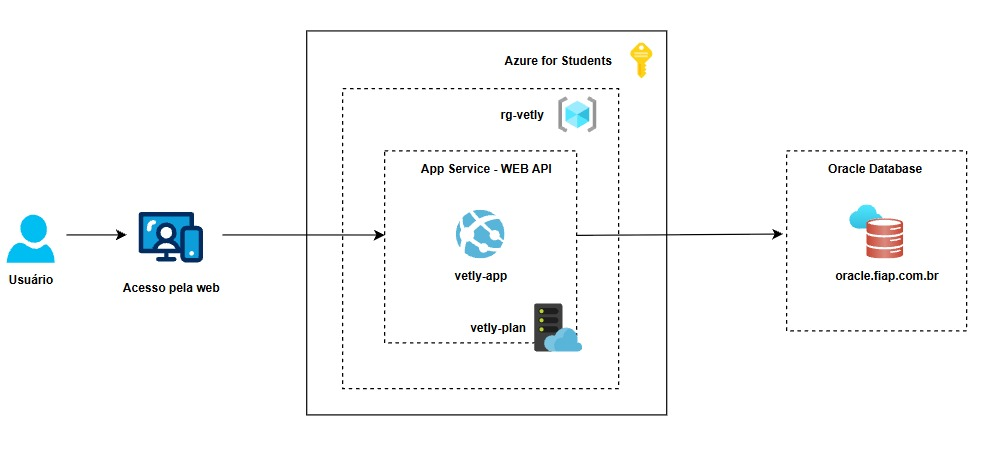

# 🐾 Vetly 

>Projeto acadêmico desenvolvido para fins educacionais.

## Integrantes

| Nome | RM |
|------|----|
| 👩‍💻 Anna Clara Russo Luca | RM561928 |
| 👨‍💻 Gabriel Duarte Maciel | RM565754 |
| 👨‍💻 Gustavo Tavares da Silva | RM562827 |
| 👨‍💻 Tiago Guedes da Costa | RM564731 |

---

# 📑 Sumário

- [📌 Descrição do Projeto](#-descrição-do-projeto)
- [🏗 Arquitetura da Solução](#-arquitetura-da-solução)
- [🚀 Tecnologias Utilizadas](#-tecnologias-utilizadas)
  - [Back-end](#back-end)
  - [Banco de Dados](#banco-de-dados)
  - [Cloud](#cloud)
- [💼 Benefícios para o Negócio](#-benefícios-para-o-negócio)
- [🗃️ Banco de Dados e Script SQL](#️-banco-de-dados-e-script-sql)
- [🧩 CRUD Implementado](#-crud-implementado)
- [☁️ Como Fazer o Deploy em Cloud (Azure)](#️-como-fazer-o-deploy-em-cloud-azure)
- [▶ Demonstração](#-demonstração)

---

# 📌 Descrição do Projeto

O **Vetly** é uma plataforma que conecta tutores de animais a veterinários independentes.
Este repositório contém o **painel administrativo** (back-office) da plataforma,
operado por um ator **ADMIN**, cobrindo o núcleo clínico da operação: cadastro de
tutores, veterinários e animais, agendamento e acompanhamento de consultas,
prontuário eletrônico versionado e solicitação/liberação de resultados de exames.

A solução foi construída utilizando **Java com Spring Boot** (MVC + Thymeleaf), banco
de dados **Oracle Database em nuvem** (instância da FIAP) e provisionamento
automatizado da infraestrutura utilizando **Azure CLI**, publicada como **Azure App
Service** (Linux, runtime Java 21).

O projeto tem como objetivo demonstrar a aplicação prática dos conceitos de:

- Cloud Computing (PaaS)
- Infraestrutura como Código (IaC) via Azure CLI
- Persistência de dados em banco relacional na nuvem
- Deploy automatizado de aplicação Java

---

# 🏗 Arquitetura da Solução



**Fluxo:** o usuário (ADMIN) acessa o painel pela web → a requisição chega ao **Azure
App Service** `vetly-app`, rodando sob o **App Service Plan** `vetly-plan`, dentro do
**grupo de recursos** `rg-vetly` (assinatura **Azure for Students**) → o App Service
se conecta via JDBC ao **Oracle Database** hospedado em `oracle.fiap.com.br`, onde
toda a persistência acontece.

Opção de entrega: **Serviço de Aplicativo (App Service) + Banco PaaS** 

---

# 🚀 Tecnologias Utilizadas

## Back-end
- Java 21
- Spring Boot 4.0.6
- Spring Security
- Spring Data JPA / Hibernate
- Thymeleaf

## Banco de Dados
- Oracle Database (instância em nuvem  FIAP, `oracle.fiap.com.br`)

## Cloud
- Microsoft Azure (App Service, App Service Plan, Resource Group)
- Azure CLI

---

# 💼 Benefícios para o Negócio

A solução Vetly entrega diversos benefícios:

### Centralização da operação
A equipe administrativa cadastra e gerencia tutores, veterinários e animais em um
único painel, sem depender de acesso direto ao banco de dados.

### Rastreabilidade clínica
O prontuário nunca é sobrescrito — toda correção gera uma nova versão vinculada à
original, com data, hora e responsável, reduzindo risco jurídico e melhorando a
auditoria do histórico clínico.

### Governança de resultados de exame
O resultado de um exame só fica visível ao tutor após liberação explícita, evitando
que um laudo ainda em análise chegue prematuramente ao cliente final.

### Automatização (IaC)
Toda a infraestrutura na Azure é provisionada via Azure CLI, de forma repetível e
sem passos manuais no portal.

### Persistência em nuvem
Os dados permanecem armazenados no Oracle da FIAP independentemente do ciclo de
vida da aplicação no App Service.

### Facilidade de Deploy
Redução do tempo de configuração do ambiente — build gera um único JAR, publicado
diretamente no App Service.

---

# 🗃️ Banco de Dados e Script SQL

Arquivo:

```text
script_bd.sql
```

Contém o **DDL completo** do schema Oracle (tabelas, colunas, chaves primárias,
constraints e comentários).

---

# 🧩 CRUD Implementado

CRUD completo (incluir, alterar, excluir, consultar) sobre as tabelas **CORE**
`TB_ANIMAL` e `TB_CONSULTA`, relacionadas entre si
(`TB_CONSULTA.ID_ANIMAL` → `TB_ANIMAL.ID_ANIMAL`):

| Operação | Animal (`/mvc/animais`) | Consulta (`/mvc/consultas`) |
|---|---|---|
| Incluir | `AnimalMvcController` → `AnimalAdminService.criar` | `ConsultaMvcController` → `ConsultaAdminService.criar` |
| Alterar | `AnimalAdminService.atualizar` | `ConsultaAdminService.reagendar` / `.transicionar` |
| Excluir | `AnimalAdminService.excluir` | `ConsultaAdminService.excluir` |
| Consultar | Listagem + detalhe | Listagem + detalhe |

---

# ☁️ Como Fazer o Deploy em Cloud (Azure)

O Vetly é implantado na Microsoft Azure como **Azure App Service** (Java 21), de
forma **manual via Azure CLI**, conectado a um banco **Oracle Database já existente**
(instância da FIAP).


### 1️⃣ Clonar o Repositório

```bash
git clone https://github.com/annaclrl/vetly-cloud.git
cd vetly-cloud
```

### 2️⃣ Preparar o Ambiente

Instale o [Azure CLI](https://learn.microsoft.com/cli/azure/install-azure-cli), caso
ainda não tenha, e registre o provedor de Web Apps (uma vez por assinatura):

```bash
az login
az provider register --namespace Microsoft.Web
```

### 3️⃣ Preparar o Banco de Dados (Oracle FIAP)

O banco já existe, é a instância Oracle da FIAP, não algo criado por esta Azure CLI.
Conecte-se a ela (SQL Developer, DBeaver ou `sqlplus`) com as credenciais fornecidas
pela FIAP e execute o script de schema disponível no repositório:

```text
script_bd.sql
```

### 4️⃣ Criar o Grupo de Recursos e o App Service

```bash
az group create \
  --name rg-vetly \
  --location canadacentral

az appservice plan create \
  --name vetly-plan \
  --resource-group rg-vetly \
  --location canadacentral \
  --sku B1 \
  --is-linux

az webapp create \
  --resource-group rg-vetly \
  --plan vetly-plan \
  --name vetly-app \
  --runtime "JAVA:21-java21"
```

### 5️⃣ Configurar as Variáveis de Ambiente da Aplicação

```bash
az webapp config appsettings set \
  --resource-group rg-vetly \
  --name vetly-app \
  --settings \
  DB_URL="jdbc:oracle:thin:@//oracle.fiap.com.br:1521/orcl" \
  DB_USERNAME="<DB_USERNAME>" \
  DB_PASSWORD="<DB_PASSWORD>" \
  ADMIN_EMAIL="<ADMIN_EMAIL>" \
  ADMIN_PASSWORD="<ADMIN_PASSWORD>"
```

> ⚠️ Substitua os placeholders pelos valores reais apenas ao executar o comando 

### 6️⃣ Build e Deploy da Aplicação

```bash
./gradlew clean build -x test

az webapp deploy \
  --resource-group rg-vetly \
  --name vetly-app \
  --src-path build/libs/vetly-java-0.0.1-SNAPSHOT.jar \
  --type jar
```

### 7️⃣ Acessar a Aplicação

```text
https://vetly-app.azurewebsites.net/mvc/login
```

---

# ▶ Demonstração

Para facilitar a validação do projeto, disponibilizamos uma demonstração completa da
solução em vídeo.

🎥 <a href="#" target="_blank">Assistir demonstração no YouTube</a>
